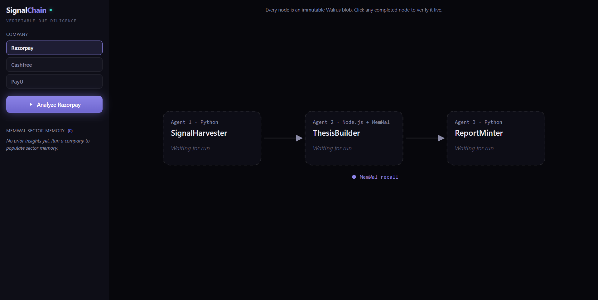

<div align="center">

# SignalChain



**Multi-agent financial due diligence where every claim is a cryptographic receipt — not a language model's best guess.**


[](https://www.walrus.xyz/)
[](https://docs.wal.app/walrus-memory)
[](https://fastapi.tiangolo.com/)
[](https://www.typescriptlang.org/)
[](https://nextjs.org/)
[](https://groq.com/)

*Built for the SUI Overflow Hackathon — Walrus Track.*

**[🔗 Live dashboard](https://signalchain-six.vercel.app)** · **[🎬 Demo video](https://drive.google.com/file/d/1e5zgcuPEK45Ry_INzVqR_QnCuJoXVrlS/view)**
<br><sub>free-tier backends sleep when idle — the first run may take ~30–50s to wake</sub>

[Demo](#-demo) · [How it works](#-how-it-works) · [Setup](#-setup) · [Verify it yourself](#-verify-it-yourself) · [Walrus Track alignment](#-walrus-track-alignment)

</div>

---

## The problem

AI research tools hallucinate citations. They generate confident prose with footnotes the model *invented* — and there is no way to prove a claim actually came from real data. For a financial analyst, "trust the model" is not a due-diligence process.

## The idea

SignalChain runs a **three-agent pipeline** that turns raw company signals into an investment memo. Every reasoning step — raw signals → analysis thesis → final report — is written to [Walrus](https://www.walrus.xyz/) as an **immutable, content-addressed blob**, and each artifact **embeds the blob ID of the artifact it was derived from**.

The result is a verifiable chain of custody. Anyone can click a claim in the final report and trace it back, blob by blob, to the source data on a decentralized network. **No central database. No hallucinated citations.** If a blob ID resolves, the artifact is real and unaltered; tamper with it and the content address changes.

```
   ┌──────────────────┐   blob_id_1   ┌──────────────────┐   blob_id_2   ┌──────────────────┐
   │  SignalHarvester │ ─────────────▶│   ThesisBuilder  │ ─────────────▶│   ReportMinter   │
   │     Agent 1      │               │     Agent 2      │               │     Agent 3      │
   │     (Python)     │               │ (Node.js+MemWal) │               │     (Python)     │
   └──────────────────┘               └────────┬─────────┘               └──────────────────┘
        │ writes                                │ recall / remember               │ writes
        ▼                                       ▼                                  ▼
   ┌─────────────────────────────────┐   ┌──────────────┐            ┌────────────────────────┐
   │     Walrus (blob_id_1)          │   │   MemWal     │            │   Walrus (blob_id_3)   │
   │     raw signals                 │   │ sector memory│            │   report + chain{1,2}  │
   └─────────────────────────────────┘   └──────────────┘            └────────────────────────┘
                          ▲                                                        │
                          └──────────  Next.js dashboard (SSE + live blob inspector) ──────────┘
```

## What it does

Pick a company (Razorpay, Cashfree, or PayU) and run the pipeline. Three agents execute in sequence, each emitting a Walrus blob ID over a live **Server-Sent Events** stream that lights up the dashboard in real time:

1. **SignalHarvester** (Agent 1, Python) loads the company's raw signals — financials, engineering activity, headcount, news — and writes them to Walrus → `blob_id_1`.
2. **ThesisBuilder** (Agent 2, Node.js) reads `blob_id_1`, **recalls prior insights about the sector from MemWal**, asks an LLM for a bull/bear thesis, stores its key insight back into MemWal, and writes the thesis to Walrus → `blob_id_2` (which embeds `source_blob_id = blob_id_1`).
3. **ReportMinter** (Agent 3, Python) reads both upstream blobs, generates a Markdown investment memo with a Provenance section, and writes the final artifact to Walrus → `blob_id_3` (which embeds `chain = { blob_id_1, blob_id_2 }`).

### Dashboard features

- **Live pipeline graph** — three nodes light up as real blobs land (backend-driven `running → complete` states, spinner + "Writing to Walrus…").
- **Blob inspector** — click any node to fetch its blob *live* from the Walrus aggregator and view the raw JSON.
- **Verify chain** — on the thesis node, one click resolves `source_blob_id` and opens the exact raw data the thesis was built from. *This is the proof.*
- **Provenance trace** — the inspector's Provenance tab renders the full `report → thesis → signals` ancestry; click any ancestor to re-root and load it live.
- **Confidence gauge** — the thesis node shows the model's `confidence_score` as a radial gauge once the blob resolves.
- **MemWal sector memory panel** — shows accumulated cross-run insights (deduped); flashes when a new one is stored.
- **Run history** — a timeline strip records every completed run; click any blob block to reopen it in the inspector.
- **View Full Report** — renders the final Markdown memo, with its provenance, beautifully on screen for the analyst.

## 🎬 Demo

> **▶ Watch the 3-minute demo:** [Demo Video](https://drive.google.com/file/d/1e5zgcuPEK45Ry_INzVqR_QnCuJoXVrlS/view)

Walk-through (matches the demo video):

1. Select **Razorpay**, click Run. Watch the three nodes light up sequentially — each shows a spinner + "Writing to Walrus…", then its blob ID.
2. Click **node 1** → the inspector shows the raw signals JSON and the live Walrus aggregator URL. *"This data lives on a decentralized network — not on our server."*
3. Click **node 2** → the thesis JSON with `source_blob_id` highlighted. Click **Verify chain** → `blob_id_1` loads into the inspector. *"Cryptographic provenance — every claim traces back to source."*
4. Click **node 3**, then **View Full Report** → the rendered due-diligence memo with its Provenance section.
5. Select **Cashfree**, click Run. The MemWal panel flashes as the **Razorpay insight is recalled**, and the Cashfree thesis references Razorpay. *"The system gets smarter across runs — memory is portable and verifiable."*

> **Pre-warm before recording:** run Razorpay once first. Identical content re-written to Walrus returns `alreadyCertified` and resolves faster.

## 🔍 How it works

**The blob chain.** Every artifact is JSON written to Walrus via a single `PUT /v1/blobs?epochs=5`, which returns a content-addressed `blobId`. Because each downstream artifact stores the blob ID of its input (`source_blob_id` on the thesis, `chain.{blob_id_1, blob_id_2}` on the report), the three blobs form a directed, tamper-evident chain. Verification is just reading blobs back from the public aggregator (`GET /v1/blobs/{id}`) and checking that the IDs line up — **no trust in our server is required, because our server never stores the data.**

**Why this kills hallucinated citations.** A normal LLM research tool emits prose with citations the model invented. Here, the thesis *cannot* reference a source it didn't actually read, because `source_blob_id` is the literal address of the bytes Agent 2 fetched, and the report carries both upstream IDs forward. The provenance is **structural, not promised**.

**Cross-run memory.** Agent 2 is th     e only service that touches MemWal. After writing each thesis it stores a one-sentence insight into a shared sector namespace (`MEMWAL_NAMESPACE`); on the next run, `recall()` surfaces those prior insights as context — so analyzing Cashfree after Razorpay produces a thesis that explicitly references what was learned about Razorpay. Memory is portable (it lives on Walrus, not in our process) and accumulates across sessions.

## 🧱 Tech stack

| Layer | Technology | Role |
| --- | --- | --- |
| Agents 1 & 3 | Python 3 + FastAPI + httpx | Walrus read/write, orchestration, SSE |
| Agent 2 | Node.js + Express + TypeScript (tsx) | Thesis building — the only MemWal client |
| Persistent storage | **Walrus** testnet (HTTP API) | Immutable blob chain for all artifacts |
| Long-term memory | **MemWal** (`@mysten-incubation/memwal`) | Cross-session sector insights |
| LLM | Groq (`llama-3.3-70b-versatile`) | Thesis (temp 0.3) + report (temp 0.2) |
| Dashboard | Next.js 14 (Pages Router) + React 18 | SSE pipeline graph, live blob inspector |
| Transport | Server-Sent Events + asyncio queues | Real-time stage updates — no broker, no Redis |

## 📁 Project structure

```
SignalChain/
├── python-agents/              # FastAPI orchestrator + Agents 1 & 3
│   ├── main.py                 #   pipeline orchestration, SSE, /internal/write-blob
│   ├── walrus.py               #   read_blob() / write_blob()
│   ├── groq_llm.py             #   async Groq client (report assembly)
│   ├── spike.py                #   Walrus round-trip check
│   ├── agents/
│   │   ├── signal_harvester.py #   Agent 1
│   │   └── report_minter.py    #   Agent 3
│   └── mock_data/              #   razorpay / cashfree / payu signals (JSON)
├── agent2/                     # Agent 2 — ThesisBuilder (Node.js + MemWal)
│   ├── index.ts                #   Express: POST /analyze, GET /memories
│   ├── memwal.ts               #   storeInsight() / recallSectorContext()
│   ├── groq.ts                 #   runThesisLLM()
│   ├── walrus.ts               #   readBlob()
│   └── spike.ts                #   MemWal store+recall check
├── dashboard/                  # Next.js verification dashboard
│   ├── pages/index.tsx         #   three-panel layout
│   ├── pages/_document.tsx     #   favicon + meta tags
│   ├── pages/api/resolve/      #   Walrus aggregator proxy
│   ├── public/favicon.svg      #   logo / favicon
│   └── components/             #   PipelineGraph / BlobInspector / MemoryPanel / ReportModal / Timeline / icons
└── .env.example
```

## ⚙️ Setup

**Prerequisites:** Python 3.11+, Node.js 18+, a [Groq API key](https://console.groq.com/), and a MemWal account.

```bash
# 1. Copy the env template
cp .env.example .env

# 2. Create a MemWal account + delegate key (testnet) at https://staging.memory.walrus.xyz
#    Fill these into .env:
#      MEMWAL_PRIVATE_KEY, MEMWAL_ACCOUNT_ID   (from MemWal)
#      GROQ_API_KEY                            (from Groq)
#    Walrus testnet needs no auth — the defaults already work.

# 3. Install dependencies
cd python-agents && pip install -r requirements.txt && cd ..
cd agent2        && npm install && cd ..
cd dashboard     && npm install && cd ..
```

## ▶ Running locally

```bash
cd python-agents && python -m uvicorn main:app --port 8000   # FastAPI orchestrator  :8000
cd agent2        && npm run start                            # Agent 2 (Express)     :3001
cd dashboard     && npm run dev                              # Dashboard (Next.js)   :3000
```

Then open **http://localhost:3000**.

## ✅ Verify it yourself

**Day-1 spikes (prove the infrastructure):**

```bash
python python-agents/spike.py     # Walrus read/write round-trip (no creds needed)
cd agent2 && npm run spike        # MemWal store + recall (needs your MemWal creds)
```

**Full pipeline via CLI (no dashboard):**

```bash
curl -X POST "http://localhost:8000/run-pipeline?company=Razorpay&sector=B2B+Fintech"
curl -N  "http://localhost:8000/pipeline/stream/{run_id}"     # SSE: running/complete events with blob IDs
```

**Confirm the chain on the public network — straight from Walrus, bypassing our app entirely:**

```bash
curl "https://aggregator.walrus-testnet.walrus.space/v1/blobs/{blob_id_2}"   # thesis → has source_blob_id == blob_id_1
curl "https://aggregator.walrus-testnet.walrus.space/v1/blobs/{blob_id_3}"   # report → has chain.{blob_id_1, blob_id_2}
```

## 🏆 Walrus Track alignment

- **Long-term memory** — Agent 2 uses **MemWal** to store a one-sentence insight per analysis into a shared sector namespace and `recall()`s them on later runs. Sector knowledge accumulates across sessions and is referenced explicitly in subsequent theses (e.g. the Cashfree thesis cites Razorpay).
- **Persistent data** — every artifact (raw signals, thesis, report) is a **Walrus** blob. There is no application database; the blob store *is* the system of record, and MemWal's memories are themselves backed by Walrus.
- **Artifact-driven workflow** — the pipeline is a chain of artifacts: `raw signals (blob_id_1) → thesis (blob_id_2) → report (blob_id_3)`. Each stage's output is a durable, content-addressed Walrus blob that the next stage reads as input.
- **Verifiable AI** — the blob-ID chain proves reasoning provenance. The thesis embeds `source_blob_id`; the report embeds `chain.{blob_id_1, blob_id_2}`. Any reader can resolve those IDs against the public aggregator and confirm exactly which data each conclusion was built from — making citation hallucination **structurally impossible**.

## 🛠 Troubleshooting

- **Walrus testnet is slow** (5–30s per write). The dashboard shows live loading states; the orchestrator emits an error event if a Walrus call exceeds 45s. Pre-warming with one Razorpay run makes the demo snappy (`alreadyCertified`).
- **MemWal `recall()` returns empty on the second run** — make sure `MEMWAL_NAMESPACE` is identical across runs and that the first run's `storeInsight` completed.
- **Node fails to reach the MemWal relayer** (intermittent `ENOTFOUND` / connect timeout) — Agent 2 forces IPv4-first DNS and retries; `storeInsight` is non-fatal so a relayer blip never sinks the pipeline.
- **`pip` / user-site issues** — install into a clean virtualenv if your global pip is broken.

## 📄 License

[MIT](./LICENSE)

---

<div align="center">

*No database. No middleman. Click any node to verify.*

</div>
